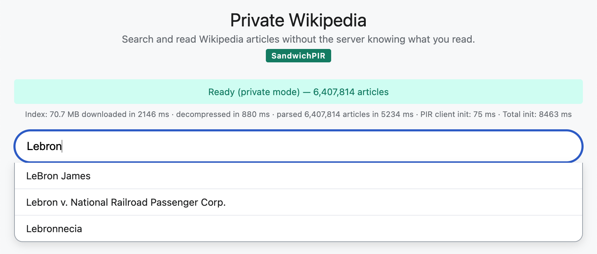

# SandwichPIR

This is an implementation of the SandwichPIR scheme for single-server private
information retrieval (paper under submission). SandwichPIR runs the server's
two heavy computations, the database scan and the response packing, as INT8
tensor-core matrix multiplications on a GPU; response compression uses the
InspiRING ring-packing algorithm. A client retrieves one record from a
server-hosted database without the server learning which record was requested.

The repository contains the core scheme (`src/`), a stateless HTTP PIR server
(`pir_server/`), a client library that compiles natively or to WebAssembly
(`pir_client/`), a reference application serving the full English Wikipedia
with in-browser search (`wikipedia/`), the sweep driver behind the paper's
measurements (`benches/`), and the baseline-scheme harness (`rodeo/`).

## Running

Requirements: Ubuntu 24.04, stable Rust, an NVIDIA GPU (tested on an L40S,
`sm_89`, CUDA 12.4), and [CUTLASS](https://github.com/NVIDIA/cutlass) v3.5.1 headers
with `rodeo/patches/12-cutlass-no-satfinite.patch` applied (the scan accumulates
mod $2^{32}$, so the saturating int8 MMA that upstream CUTLASS emits must wrap;
`rodeo/setup/setup-gpu.sh` applies this automatically).
The CPU fallback builds without CUDA. The browser client additionally needs the
[wasm-bindgen CLI](https://github.com/rustwasm/wasm-bindgen/releases).

```bash
git clone https://github.com/NVIDIA/cutlass.git ../cutlass
./scripts/build.sh                      # or: cargo build --release --features cuda

# Serve a 4 GB flat database (65536 rows of 64 KB)
./target/release/pir-serve --db my_database.bin \
    --num-items 65536 --item-size-bits 524288 --listen 0.0.0.0:8080

# Query it privately; verifies against a direct fetch
./target/release/pir-query --server localhost:8080 --row 42 -v
./scripts/test-pir.sh localhost:8080 42
```

Every query is a single stateless POST (`GET /api/info`, `POST /api/query`);
there are no sessions, no setup step, and no hint download.

## Options

- `pir-serve`: `--db <file>` (flat binary, `num_items * item_size` bytes),
  `--num-items`, `--item-size-bits`, `--listen`.
- `VERBOSE=1` prints the per-phase GPU timing breakdown (no overhead when
  unset).
- `MULTI_GPU=N` column-shards the database across N GPUs in one process.
- `HINT=gemm` selects the tensor-core hint kernel in place of the default NTT
  hint (measured for the paper's modulus-switching remark; the NTT hint is
  faster and is the default).

## Parameters

Records are database rows: a database is `num_items` rows of `item_size_bits/8`
bytes. Fixed cryptographic parameters: ring dimension d = 2048, ciphertext
modulus Q = 4294955009 (the largest NTT-friendly prime below 2^32), word
modulus W = 2^32, plaintext modulus p = 256, secret/error distribution D(0.5),
gadget base 256 with depth 4.

`python3 scripts/noise_bounds.py --select` prints the output-moduli selection
grid (the correctness/communication tradeoff behind the choice of
$q_1 = 2^{18}$, $q_2 = 2^{10}$).
`python3 scripts/noise_bounds.py <num_items> <item_size_bits>` prints the
correctness failure probability (per entry and per record, matching the paper's
theorem and corollary) and the communication for any shape. All configurations
up to 1 TB satisfy log2(delta) < -90 per record.
`sage -python scripts/estimator_wrapper.py` reproduces the security estimate
(lattice estimator pinned at commit `53da598`; clone it next to this repo).

Security: 192 bits against known lattice attacks, estimated with the
[lattice-estimator](https://github.com/malb/lattice-estimator)
([`53da598`](https://github.com/malb/lattice-estimator/commit/53da5982597709ba0fdf94ea37a84d822310fd84)),
`LWE.Parameters(n=2048, q=4294955009, Xs=D(0.5), Xe=D(0.5), m=2^23)`:

```
usvp: 2^201.0   bdd: 2^199.2   bdd_hybrid: 2^199.3   dual_hybrid: 2^192.7
```

## Interpreting measurements

The benchmark binary emits a `Measurement` JSON (offline and online times, byte
counts, per-phase breakdown, per-trial variance). `benches/sweep.py` drives it
across the database and batch sizes used in the paper and aggregates the
results; see `benches/README.md`.

## Reproducing results from the paper

`rodeo/REPRODUCE.md` maps every table and figure in the paper to the data file
behind it and the runner or sweep script that regenerates it, including the
baseline schemes (pinned as submodules under `rodeo/schemes/`, patched by
`make -C rodeo schemes`).

## Private Wikipedia

The reference application serves all 6.4 million English Wikipedia articles
(brotli-compressed and bin-packed into 128 KB rows by `wikipedia/build/`) with
private in-browser search:

```bash
./scripts/run-wiki.sh /path/to/wikipedia.bin 65536 1048576
# open http://localhost:8088
```



## Acknowledgements

The implementation extends
[spiral-rs](https://github.com/menonsamir/spiral-rs) and the
[YPIR](https://github.com/menonsamir/ypir) codebase.

## Authors

- [Sidaarth Sabhnani](https://sidsabhnani.com) — UT Austin
- [David J. Wu](https://www.cs.utexas.edu/~dwu4/) — UT Austin
